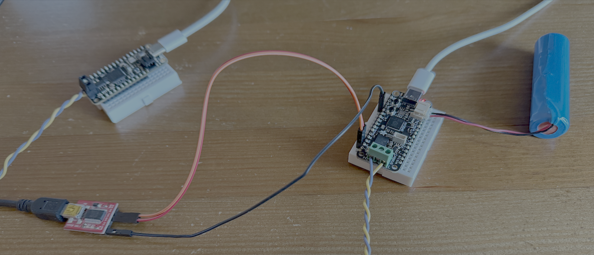
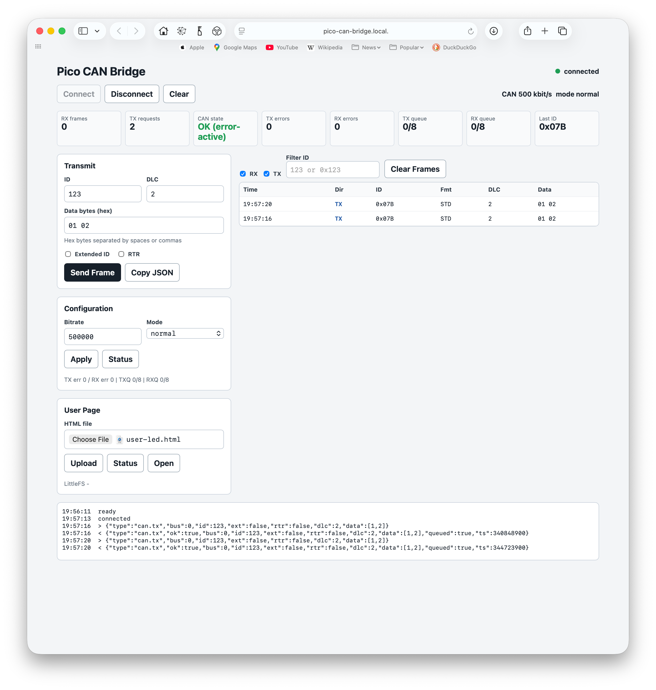
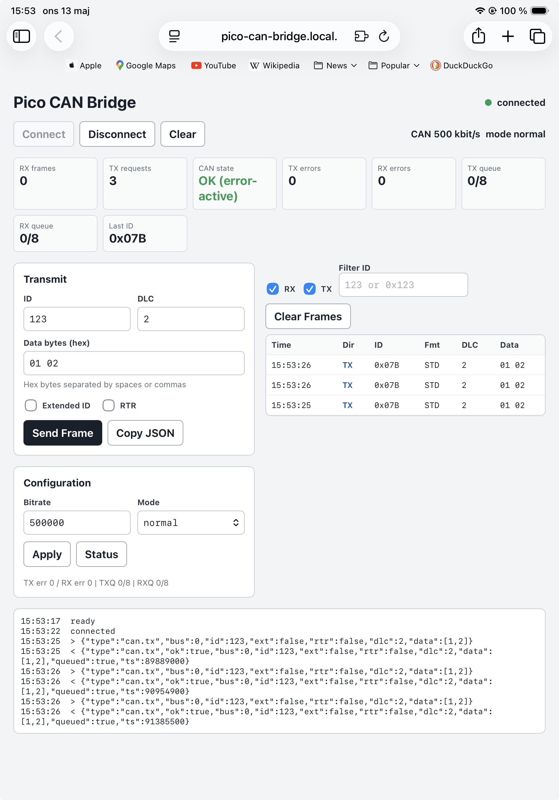
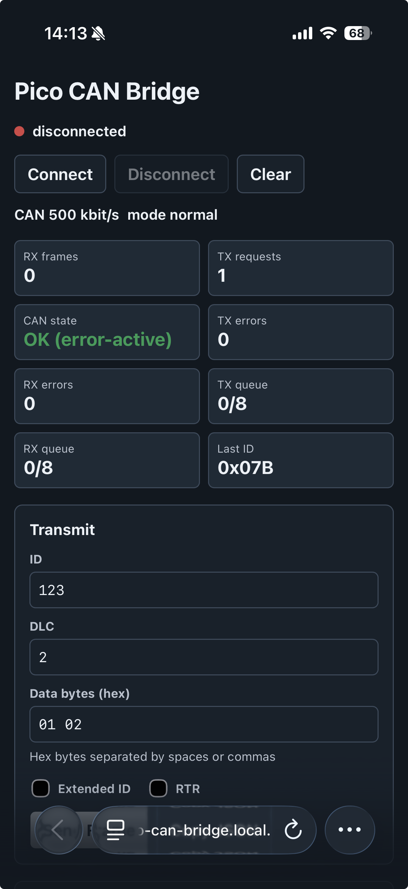
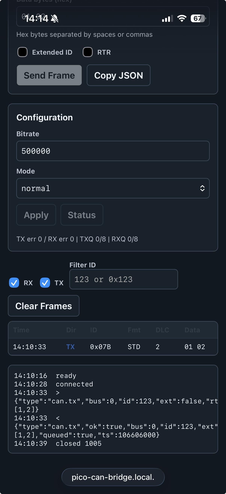

# Pico CAN Bridge

Firmware for the [Adafruit Feather RP2040 CAN Bus board](https://www.adafruit.com/product/5724).
The board appears as a USB CDC-NCM network interface and exposes a small web UI
plus a JSON WebSocket API for CAN traffic.

Current features:

- USB CDC-NCM using Zephyr's USB device stack next
- IPv4 link-local addressing
- mDNS hostname and DNS-SD HTTP service announcement
- HTTP web UI served from the firmware
- Optional user HTML page served from LittleFS at `/user`
- WebSocket CAN bridge at `/can`
- JSON CAN TX/RX/status/config protocol
- MCP25625 CAN controller/transceiver in normal, loopback, or listen-only mode
- Startup recovery for a macOS/RP2040 CDC-NCM alternate-setting race

## Current status

This project is in early development. It is functional on the tested Apple
USB-C hosts, with known RP2040/Zephyr CDC-NCM startup quirks documented in
[docs/known-issues.md](docs/known-issues.md). Additional host platforms will
be listed as they are tested.

Prebuilt UF2 test builds are available from the
[GitHub Releases page](https://github.com/ulso/pico-can-bridge/releases).

## Hardware

The firmware targets the
[Adafruit Feather RP2040 CAN Bus board](https://www.adafruit.com/product/5724).
The photo below shows a test setup with the Pico CAN Bridge board connected to
another CAN node, a battery, USB-C, and a serial debug adapter on the board's
TX/RX pins.



## Screenshots

### Desktop web UI



### iPad



### iPhone





## Build

Run the build from the Zephyr workspace so `west build` finds Zephyr's command extensions.
Replace `<zephyr-workspace>` and `<repo>` with your local paths:

```sh
cd <zephyr-workspace>
./venv/bin/west build --pristine \
  -b adafruit_feather_canbus_rp2040 \
  -d <repo>/build \
  <repo>
```

The UF2 ends up at:

```text
<repo>/build/zephyr/zephyr.uf2
```

## USB CDC-NCM

The firmware uses IPv4 link-local autoconfiguration on the CDC-NCM interface.
The host should also use link-local addressing on the new USB network
interface.

The firmware uses Zephyr's sample USB VID/PID (`0x2FE3:0x0100`) and its own
USB product/manufacturer strings. This intentionally differs from the original
Adafruit CircuitPython USB identity for the board (`0x239A:0x8130`).

This project currently carries a local Zephyr CDC-NCM patch for macOS
alternate-setting handling:

```text
patches/zephyr-cdc-ncm-macos-altsetting.patch
```

Apply it in the Zephyr workspace before building if the workspace has been
updated or reset. In particular, run this check after every `west update`,
because updating Zephyr can replace the locally patched CDC-NCM source file.

```sh
cd <zephyr-workspace>/zephyr-main
git apply --check <repo>/patches/zephyr-cdc-ncm-macos-altsetting.patch
git apply <repo>/patches/zephyr-cdc-ncm-macos-altsetting.patch
```

If `git apply --check` reports that the patch is already applied, confirm that
`subsys/usb/device_next/class/usbd_cdc_ncm.c` is locally modified before
building.

The board advertises:

```text
Hostname: pico-can-bridge.local
Service:  _http._tcp.local
Port:     80
```

After flashing, unplug and reconnect USB, then test:

```sh
ping pico-can-bridge.local
curl http://pico-can-bridge.local/
dns-sd -B _http._tcp local
dns-sd -L pico-can-bridge _http._tcp local
```

Give macOS a few seconds after reconnecting the board before starting the
DNS-SD browse.

The onboard LED blinks while CDC-NCM/link-local setup is pending and stays on
once the firmware has a link-local IPv4 address.

The root HTTP endpoint serves a small browser UI for the WebSocket endpoint.

## Web UI

Open:

```text
http://pico-can-bridge.local/
```

The UI can connect to the CAN WebSocket, transmit frames, display received
frames, show CAN status, change bitrate/mode, and copy the current transmit
frame as JSON for scripts.

The root page is always the built-in firmware UI. This keeps a known-good
control surface available even if an uploaded user page is missing or broken.

### User Page Storage

The firmware also exposes a LittleFS-backed user page at:

```text
http://pico-can-bridge.local/user
```

The built-in web UI can upload an HTML file to this page from the User Page
panel. The same operation can also be done with curl:

```sh
curl -i -X PUT \
  -H "Content-Type: text/html; charset=utf-8" \
  --data-binary @my-page.html \
  http://pico-can-bridge.local/user/index.html
```

Uploaded pages are stored as `/lfs/user/index.html` and are served back from
LittleFS. The current upload limit is 512 KiB. If no user page has been
uploaded, `/user` returns `404 Not Found`.

Filesystem status is available at:

```text
http://pico-can-bridge.local/fs/status
```

## WebSocket

The firmware exposes the CAN WebSocket endpoint at:

```text
ws://pico-can-bridge.local/can
```

The legacy `/ws` endpoint is kept as an alias for older tests. The endpoint
accepts JSON-formatted CAN frames and replies with a JSON result.
For a quick browser-console test:

```js
const ws = new WebSocket("ws://pico-can-bridge.local/can");
ws.onmessage = (event) => console.log(event.data);
ws.onopen = () => ws.send(JSON.stringify({
  type: "can.tx",
  bus: 0,
  id: 1234,
  ext: false,
  rtr: false,
  dlc: 2,
  data: [1, 2]
}));
```

See [docs/protocol.md](docs/protocol.md) for the JSON protocol.

Python client examples are available in [examples/](examples/).

## Documentation

- [docs/sdd.md](docs/sdd.md): software design description
- [docs/protocol.md](docs/protocol.md): WebSocket JSON protocol
- [docs/known-issues.md](docs/known-issues.md): known USB/macOS notes and local Zephyr patch
- [docs/release.md](docs/release.md): manual release checklist

## License

Licensed under either of:

- [Apache License, Version 2.0](LICENSE-APACHE)
- [MIT license](LICENSE-MIT)

at your option.

## Development

This project was developed in close collaboration with OpenAI Codex, used for
firmware implementation, debugging support, documentation, and iteration on the
built-in web UI.
